# Good Software Engineer — кто это?

Порассуждаем о лучших качествах специалистов в индустрии разработки ПО. Начнём с терминологии, дабы убедиться, что говорим об одних вещах, а дальше разберем все крупные этапы становления специалиста. Какой опыт мы приобретаем на каждом этапе, с чем сталкиваемся, благодаря чему двигаемся дальше. Выясним все аспекты, формирующие человека, про которого потом можно уверенно сказать — вот хороший специалист. Осторожно, под катом много картинок для лучшего запоминания.

<cut />

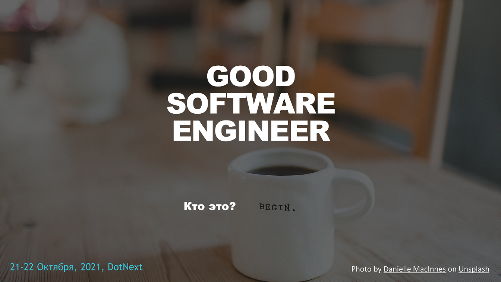

День добрый. Меня зовут Никита Данилов, начинал как WPF .NET программист, а сейчас заядлый .NET Back-end программист. Прошел аспирантуру, преподавание в учебном центре и университете, что вызвало у меня определенную профессиональную деформацию. Некоторое время назад мне посчастливилось таки выступить на DotNext 2021 Moscow с докладом [Good Software Engineer — кто это?](https://www.youtube.com/watch?v=C0dPTfvCHms&ab_channel=DotNext), расшифровкой которого хочу поделиться. Сегодня мы поговорим о том, кто такой хороший инженер программного обеспечения. 

## Вступление

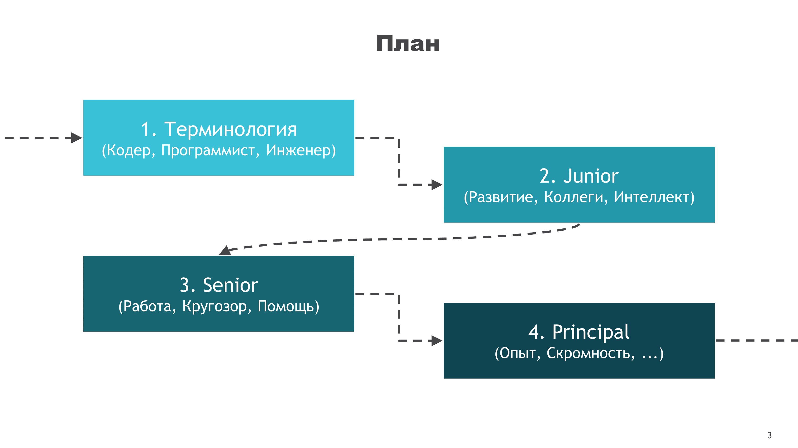

Доклад обобщает некоторый опыт о моих наблюдениях лучших качеств специалистов в нашей индустрии разработки программного обеспечения. Начнем мы с терминологии, а затем пройдем по шагам крупные этапы становления специалиста. Какой опыт мы приобретаем на каждом этапе и благодаря чему движемся дальше. Выясним все аспекты формирующие человека, про которого потом уверенно могут сказать — вот он хороший специалист.

Повторюсь, доклад это агрегация опыта как моего, так и знакомых. Наверняка у вас будут вопросы, ваше личное мнение, я бы с радостью обсудил их в комментариях. Начинаем.

## Терминология

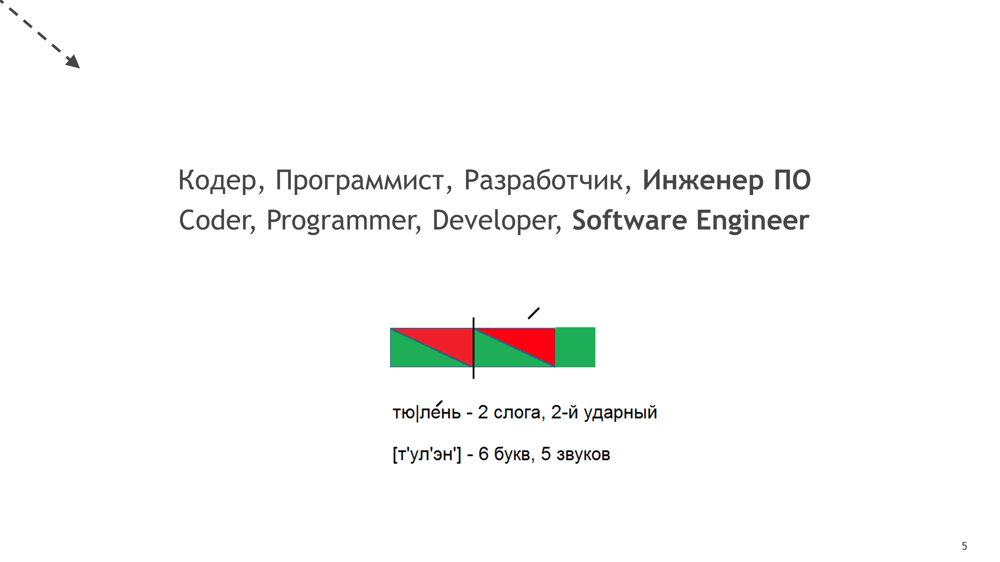

А начнем мы с терминологии. Кто-то может считать это всё пустой демагогией, тем не менее, именно с развитием терминологии я связываю зрелость отрасли. Кем вы себя считаете, на том и будете фокусироваться. Есть ведь «кодер», есть «программист», «разработчик», и есть «инженер» — слова то разные.

Любопытно, есть ли из присутствующих кто считает что это синонимы? К моей радости, шутки про «тыжпрограммист» уже стали менее распространёнными. Люди вне IT сферы постепенно поняли — мы подчас занимаемся совершенно разными вещами. Давайте тогда и мы сейчас разберём эти термины.

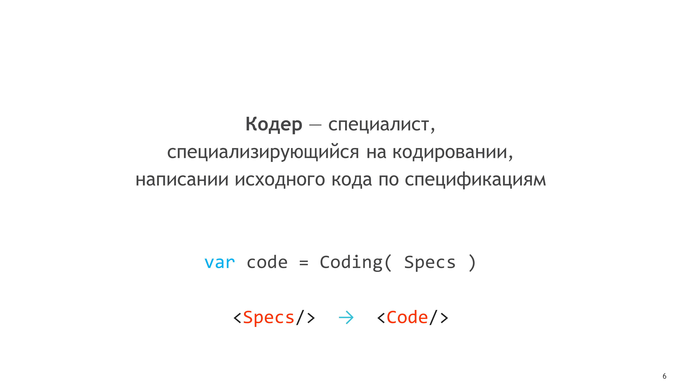

Есть термин «кодер», очень популярный в массовой среде, есть книга «Кодеры за работой» (правда тут же с уточнением о ремесле «программиста»).
Насколько я понимаю устройство нашего сознания, раз сам термин включает слово «код», вероятнее всего, для человека главный результат труда и будет код.
Вот только давно стало понятно, что нельзя просто взять и превратить спецификацию в код.
Прежде чем сесть писать код, необходимо продумать архитектуру системы, всех движущихся частей. После написания же, потребуется доставка, поддержка и развитие вашего решения. Т.е. если вы лишь кодер, и умеете лишь преобразовывать слова в код, то, скорее всего, вы не сможете предоставить крупное решение целиком.

TODO: Испорчен энтерпрайзом?
Сейчас еще разговоров то про литкод.

Ваша ценность как специалиста примерно на уровне транспилятора в большинстве случаев.
Безусловно, я слышал про отдельные ниши высоко-алгоритмического программирования, где сам код требует титанических ... 

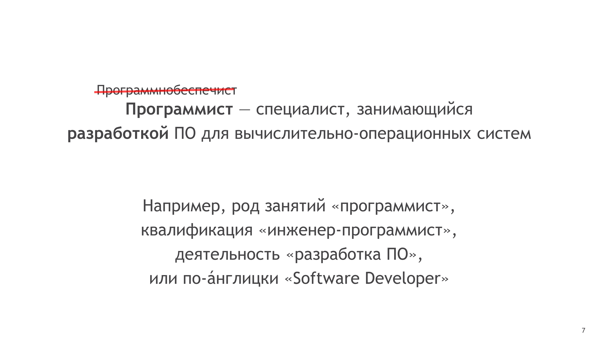

Насколько я могу судить, всё-таки больше прижился термин «программист». Это человек создающий различное программное обеспечение, что подразумевает явно больше действий чем превращение спецификации в код. Сам термин «программное обеспечение» вошёл в обиход с 1960-х годов, когда появилось разделение команд пишущих программную часть и собирающих железную.
Сейчас, говоря «программа», зачастую мы подразумеваем «программное обеспечение», хотя второе это более широкое понятие и может включать набор программ, инструкции и документация, данные и многое другое, но сейчас не об этом. Раз термин «программнобеспечист» не прижился, то будем программистами, вопрос только какими.

Наконец «инженер», термин с богатой историей, определяющий того, кто изобретает новое или улучшает существующее решения некой проблемы.

Инженеры, как правило, вовлечены во все процессы жизненного цикла решения, включая (вдох): исследования, планирование, проектирование, разработку, документацию, производство, наладку, испытание, эксплуатацию, обслуживание, управление качеством и т.д.
Опираясь на фундаментальные и прикладные науки инженер находит и реализует решение проблемы.

Разве ничего не напоминает? Решение проблем и является основной задачей нашей профессии. Разными способами мы решаем проблемы заказчика. Основным способом будет создание программы, конечно, хотя не единственным. Важно, что инженерия означает наличие подходов, практик решения проблем, вдумчивое изобретение. Что требует максимального участия в жизненном цикле ПО.

И вот почему это важно. С одной стороны — программист сферичен. Мы часто любим замыкаться, концентрироваться в себе. Мы работаем с чистой мыслью в нашей голове, творя новое из ничего.

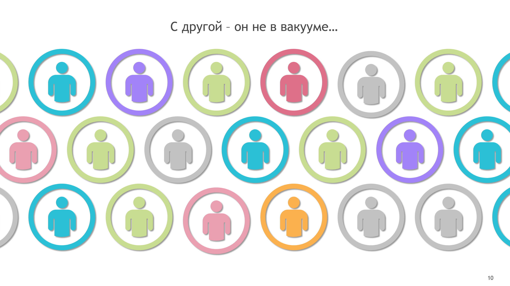

С другой стороны, вокруг не вакуум, вокруг нас существует мир. Он состоит из самых разных людей. Мы используем библиотеки написанные другими, читаем ТЗ написанные другими. Рефакторим код написанный кем то другим. Т.е. во-первых – вокруг нас всегда есть другие люди, живые, с которыми полезно общаться. Во-вторых – есть результаты их деятельности — код, ТЗ, дизайн, отчеты о багах. Создать значимый продукт без этого мне уже не видится возможным. Обратите внимание сколько новых профессий появилось в ИТ-проектах всего-лишь за последние 10 лет.

Вот и получается, что для качественного решения проблемы, вы должны пообщаться, обдумать, выбрать и т.д. Т.е. поучаствовать в жизненном цикле ПО.

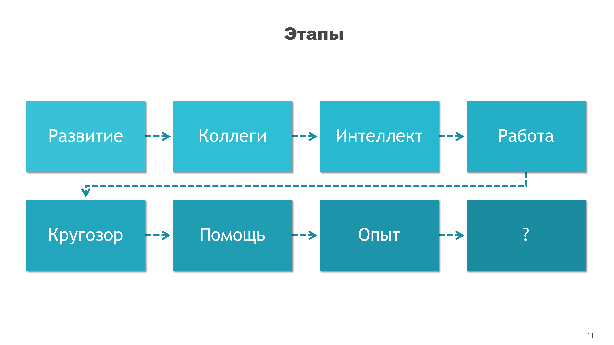

Как же строится профессиональный путь человека, участвующего в разработке крупных решений? Давайте пройдем по всем этапам и выясним.

## Junior 

**Вопрос**: С чего начинается развитие человека вообще?

Насколько я понимаю, после стадии минимального «приспособления» (адаптации), которое стимулирует развитие, дальше требуется «любопытство»: «А что если сделать вот так?».

**Вопрос**: Чем подкрепляется любопытство?

Экспериментом и результатами. Это заложено в нашем организме, мы приспосабливаемся к миру и наш мозг поощряет нас за получение жизненно важной информации (или хотя бы кажущейся таковой).

Да, метафора стара, но это похоже на первые шаги ребенка. Ему любопытно что там за границей песочницы. Теперь, необходимо проверить — провести эксперимент.

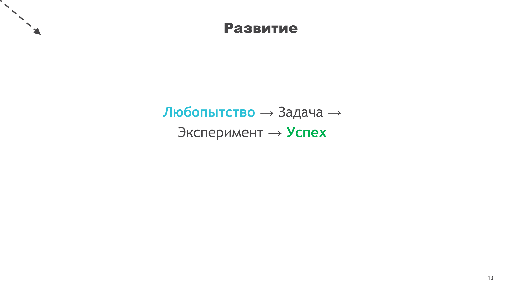

Любопытство порождает задачу. Задача требует эксперимента для решения, когда вы применяете свои навыки и оцениваете результат. И по-моему, крайне всё удаётся с первого раза. Можно вспомнить любой возраст, любой период. Постройка домика из кубиков в детстве, катание на велосипеде в юности, деплой на продакшн. Если говорить про действительно новое, то это подразумевает отсутствие наработанных навыков.

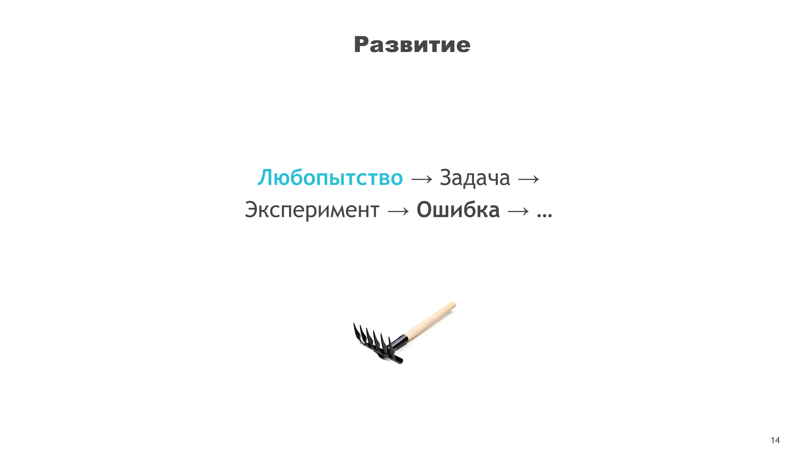

Скорее, сначала у вас что-то не получится, **но** именно здесь кроется развитие. Развитие начинается с любопытства к любым вопросам и темам. В нашей профессии, человек становится начинающим программистом, когда проявляет любопытство и начинает экспериментировать.

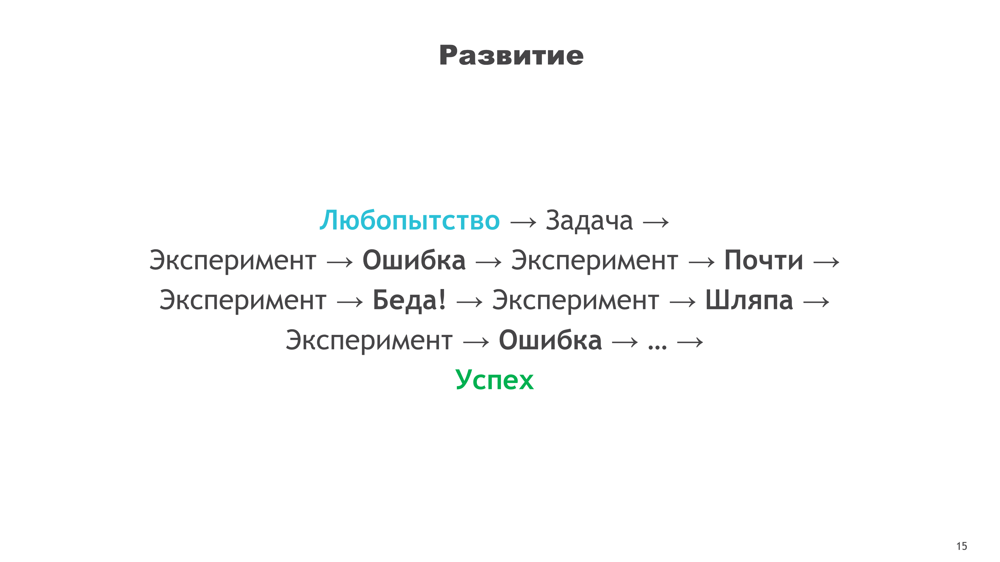

Его развитие основывается на экспериментах и результатах. Вообще развитие человечества строится на этом. Когда то, ошибка пещерного человека на охоте стоила ему жизни, но община узнавала — один мамонт сильнее одного человека, надо ходить на охоту вместе. Нынче цена ошибки теперь значительно снизилась. Вот джуниор только начал учиться. Сидит перед ноутбуком, у него открыта среда разработки.

**Вопрос**: Каков худший результат ошибки джуниора?

Не компилируется. Или возникнет Runtime-исключение. Или среда разработки зависнет (или [будет удалена продакшн БД](https://www.reddit.com/r/cscareerquestions/comments/6ez8ag/accidentally_destroyed_production_database_on/), но вы же соблюдаете технику безопасности?)

Зато, он узнает что переменной нужно присвоить значение. Да, избитая мысль, что в целом допускать какие-то ошибки это свойственно всем. Не зря ошибки не отмечены красным. Получается, ошибка это не трагедия. Неспособность к обучению на ошибках — вот что такое трагедия. Если программисту что-то кажется магией, то программист проявляет любопытство и разбирается почему это **не** магия.

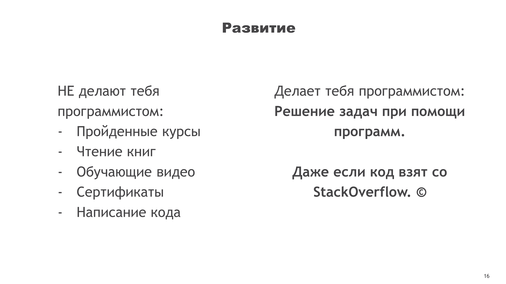

Что отличает программиста от других профессий — это способ решения задачи. Скорее всего, задачу мы будем решать именно путем создания некой программы. Тут, внезапно, ни курсы, ни книги, ни тренеры не сделают из тебя программиста. Они могут значительно помочь, дать знания, **но** только решение задач при помощи программ делает из тебя программиста. Даже если код взят со StackOverflow, Sql.ru, или любого иного места. Не суть. На самом первом этапе мы именно учимся решать задачи при помощи кода, узнавая попутно новое.

### Коллеги

Здесь я хочу особо выделить важный момент про коллег. Давайте вспомним свои студенческие годы. Тонны информации вливались прямо нам в голову. Мы делали невероятные задания за один вечер.

**Вопрос**: Кто как считает, почему нам это удавалось?

Кроме того, что в принципе мы были совсем молодые, я помню мы ещё много общались, обменивались, списывали, переписывали.

К сожалению, я видел как часто забывали про это. Думали мол устроился на работу и теперь несолидно идти списывать, или спрашивать у старшекурсников решение. Хотя в университете это отлично работает. Ситуация ведь ровно та же: Нас окружают люди, кто-то из них также лишь начинает свой профессиональный путь, другие уже решали подобные задачи и имеют богатый опыт по теме.

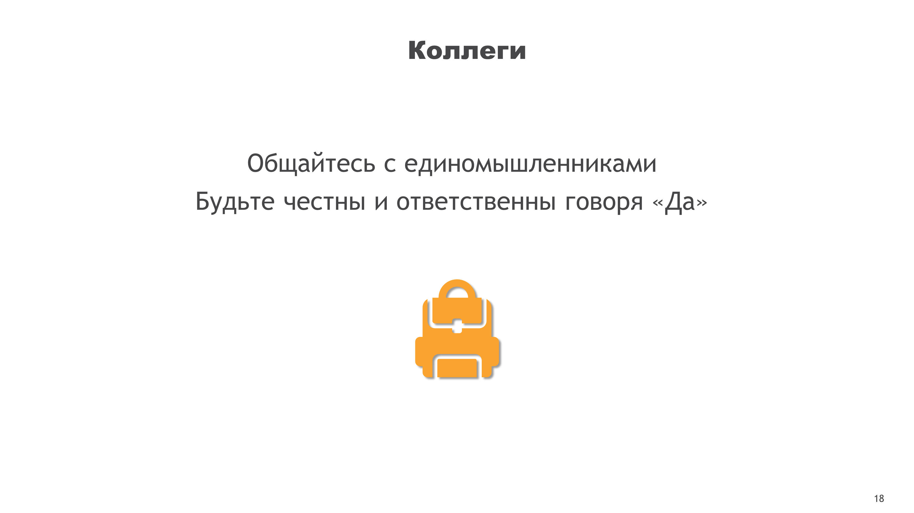

Поэтому, важно общаться с единомышленниками (что мы и делаем на конференциях).
Это позволяет узнавать новое быстрее, решать проблему лучше. Общаться при этом ответственно. Если кому то пообещать, а потом не сделать – вы рискуете заработать сомнительную репутацию. Потом так же поступят с вами. На этом этапе мы учимся ответственно говорить «Да», брать ответственность за наши предложения и решения.

> Книга «Совершенный код», глава 33 «Личность». Общайтесь с единомышленниками Познакомьтесь с другими людьми, стремящимися улучшить навыки разработки ПО. Становление высококвалифицированного программиста предполагает развитие обостренного чувства профессиональной честности. Работая над кодом, не забывайте про людей, которым придется изменять его в будущем. Изучайте успешные проекты. Особенно хороший способ самообразования — изучение опыта лучших программистов.

> Книга «Идеальный программист». 3. Как сказать «Да». Ответственно относитесь к своим словам. Выполняйте обещанное.

Обязательно думайте про других людей, им потом переписывать ваши лекции, т.е. читать ваш код. Пытаться понять что же вы имели в виду. Как [довольно давно известно](https://devblogs.microsoft.com/oldnewthing/20070406-00/?p=27343), в нашей профессии мы гораздо больше читатели, чем писатели. Мы больше читаем чужого или своего кода, чем пишем нового.

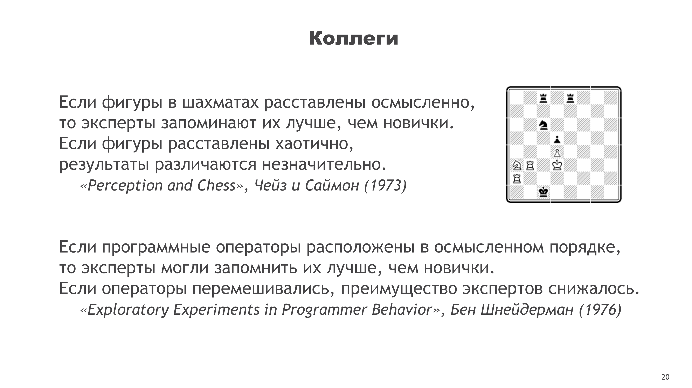

Хотелось бы упомянуть два эксперимента:

- [William G. Chase and Herbert A. Simon - Perception in chess](https://notes.andymatuschak.org/Chase_and_Simon_-_Perception_in_chess) ([полный текст](https://citeseerx.ist.psu.edu/viewdoc/download?doi=10.1.1.601.2724&rep=rep1&type=pdf))
- [Ben Shneiderman - Exploratory Experiments in Programmer Behavior](https://www.semanticscholar.org/paper/Exploratory-experiments-in-programmer-behavior-Shneiderman/b7a97d7f6c623cf6efefff73343009886d08342b) ([полный текст](http://www.cs.umd.edu/~ben/Shneiderman1976Exploratory.pdf))
Первый связан с шахматами, а второй с программированием, оба основаны на одинаковом предположении, что нашему мозгу (когнитивным моделям) легче работать со знакомыми ситуациями.

Во втором эксперименте разным группам программистов показывали код (от студентов кто вообще кода не видел, до прошедших уже несколько курсов), а затем просили воспроизвести его. Оказалось, что информация запоминается скорее по смыслу, на основе прошлого опыта и знаний, нежели в конкретном синтаксисе исходного образца. Иным словами, знакомые конструкции и запоминается легче.

Т.е. это всё про общие практики, Best practices так называемые.
Если код написан единообразно, логичен для всех в команде, то работать с таким кодом значительно легче всем.
Если же код совершенно незнаком и не удаётся найти общую идею, то мозгу приходится запоминать его просто как набор символов, что заведомо труднее.

### Книги

Поэтому, я бы хотел упомянуть про книги.
Написано немало книг про нашу профессию.
Книги сверху они хорошие, полезные, и вроде даже про лучшие практики, но мистер Дрейк как бы намекает.
Прежде всего я бы предложил сфокусироваться на тех двух книгах внизу слайда.
Это «Совершенный код» Стива Макконнелла и «Идеальный программист» Роберта Мартина, которые и про код, и про людей, и про профессию.

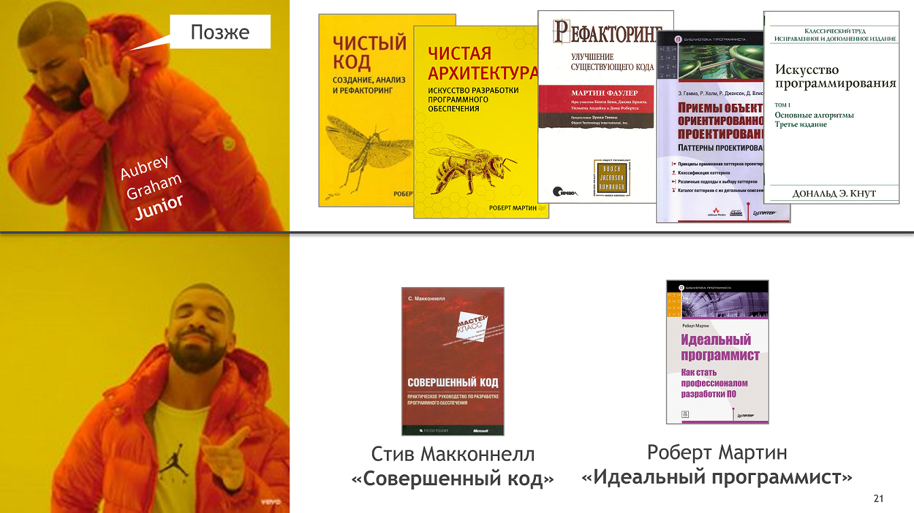

На мой взгляд, самые важные книги они про ваши рабочие привычки и инженерные навыки.
Именно поэтому, доклад так и называется.
Полезнее научиться вдумчивому подходу к работе, нежели сразу заучивать конкретные техники и алгоритмы.
Полезнее научиться понимать как устроено решение, прежде чем бросаться его переделывать.
Ну и полезно понимать, что вокруг тебя тоже есть живые люди.
В дискуссионной зоне думаю мы потом можем подробнее обсудить.
Повторюсь, книги сверху они нужны, но чуть попозже.

Slide 22

Постепенно, по завершению первого этапа развития, мы понимаем в чем сила.
А сила в интеллекте, мозге. И важно начинать ценить его работу.
Именно прокачка вашего мозга позволяет нам решать задачи лучше, быстрее.
Поддержание мозга в хорошем состоянии, становится важным делом.
Сначала, нам пока хватает просто осознания этого, мы еще только начинаем загружаться знаниями.

---
Книга «Совершенный код», глава 33 «Личность».
Если вы разрабатываете ПО, вашим основным строительным материалом является интеллект, а главным инструментом — вы сами.
Если вы хотите стать отличным программистом, вы отвечаете за это сами. Это зависит от вашего характера.

Slide 23 

Таким образом, в начале нашего пути мы учимся развиваться вообще.
Учимся общаться, быть в коллективе и осознавать возможности нашего интеллекта.
Так проходят первые годы сначала джуниора, а затем и миддла.

Slide 24

Проходит некоторое время и миддл вырастает в сеньора.
Он понимает полную безграничность своих возможностей.
Дальше явная тропка пути теряется в глубинах космоса, книг и интернетов.

Вопрос: Кто мы себе представляем сеньора? 

Это довольно широкое понятие, но здесь есть некие ключевые моменты.Естественно, он должен поставлять качественные решения в срок.
Он следует процессу разработки и понимает кто все эти люди вокруг.
Он способен сам решить сложную задачу с нуля.
Выбрать решение, обосновать, спроектировать даже немного и реализовать.
Можно сказать, джуниор и миддл работает именно с задачами и больше на этапе реализации.
Сеньор работает с пользовательскими историями, начиная с предварительных этапов.

С какой же проблемой сталкиваются практически все на этом этапе?
Тут я имею очень много наблюдений по ближним и дальним знакомым, и по себе.

Slide 25

Вы начинаете уметь больше, следовательно вы начинаете делать больше.
Где-то еще на стадии миддла вы вдруг начинаете вписываться во всё, до чего можете дотянуться.
Либо просто наслаждаетесь тем, как здорово вам удаётся работать, вас слышат, вы творите добро.
И внезапно вы осознаете что впахиваете круглые сутки. Чем больше пашете, тем больше впахиваете. 
Как этот хомячок.
Это рождает спутанные мысли, недоумение, чем быстрее я бегу, тем быстрее нужно бежать.
Распространенная проблема. Я сам периодически попадаю в такую ситуацию.

Вопрос: Как считаете, почему этот хомячок постоянно занят?

---
Книга «Совершенный код», глава 33 «Личность».
Если какой то программист постоянно занят, вполне можно подумать, что он — неважный программист, потому что он не использует свой наиболее ценный инструмент, которым, как известно, является голова.
Книга «Идеальный программист».
13. Уклонение от работы. Пресекай инверсию приоритетов. Тупик — это когда вы принимаете решение, а оно оказывается не очень хорошим и чем дальше вы углубляетесь, тем хуже. Нужно отпустить кактус. Грязь в коде снижает производительность до нуля.

Slide 26

Казалось бы парадокс, но он впахивает потому что ленится. Только лень проявляется по разному.
Бывает – негативно. Начнем с неявного. Хомячок ленится подумать.
И мы, вместо того чтобы подумать – надо ли срочно это делать, бросаемся делать.
Не пытаемся понять приоритеты, а просто – вот что понятнее то и делаем.
Если выяснится что сделать мы это можем только за месяц, а у нас есть неделя. Надо ли нам вообще это делать?
Это вопрос. Но на него вероятно отвечать не только вам лично. Но надо задуматься.
Нашлась ошибка, надо исправить. Лень думать – подставим костыль побыстрее. 
Вот так мы и подставляем себя, и всю команду.

---
Книга «Совершенный код», глава 33 «Личность».
Анализируйте и планируйте, прежде чем действовать.
Лень может проявляться несколькими способами: отсрочка выполнения неприятной задачи; немедленное выполнение неприятной задачи с целью как можно более быстрого избавления от нее; написание инструмента для выполнения неприятной задачи, чтобы ее никогда не пришлось выполнять снова.
Книга «Идеальный программист».
2. Говорите «Нет». Рабы не могут сказать «Нет», а наёмные работники могут. Если же вы профессионал, — это ваша обязанность.
Когда руководитель ставит нереальный срок, ваша обязанность сказать «нет». Если вам предлагают быстрое, но архитектурно слабое решение, ваша обязанность сказать «нет». Когда вам предлагают работать по ночам, ваша обязанность сказать «нет».
5. Отставание от графика. Готово — это значит, что успешно пройдены все автоматизированные приёмочные тесты.
11. Планирование. Встречи — зло и только иногда добро. Пятиминутка — добро. Это часть гибкой методологии и без неё никуда.
14. Оценка. Бизнес считает оценку обязательством, а разработчик — предположением.

Slide 27

Вытекающее из этого проявление лени – когда мы НЕ делаем чего то.
Вот мы сильно загружены уже. И просто тихо сливаем какие-то задачи, пока никто не видит.
Тем самым, подставляя всех – заказчика, кто страдает без фичи.
Тимлида и менеджера, кто закладывает оценки, им потом головой отвечать.
Себя и команду – всё что мы отложим, потом может выстрелить.
Как? Надо будет сделать 100 задач за день до релиза. И понеслась.

---
Книга «Совершенный код», глава 33 «Личность».
Анализируйте и планируйте, прежде чем действовать.
Лень может проявляться несколькими способами: отсрочка выполнения неприятной задачи; немедленное выполнение неприятной задачи с целью как можно более быстрого избавления от нее; написание инструмента для выполнения неприятной задачи, чтобы ее никогда не пришлось выполнять снова.
Книга «Идеальный программист».
2. Говорите «Нет». Рабы не могут сказать «Нет», а наёмные работники могут. Если же вы профессионал, — это ваша обязанность.
Когда руководитель ставит нереальный срок, ваша обязанность сказать «нет». Если вам предлагают быстрое, но архитектурно слабое решение, ваша обязанность сказать «нет». Когда вам предлагают работать по ночам, ваша обязанность сказать «нет».
5. Отставание от графика. Готово — это значит, что успешно пройдены все автоматизированные приёмочные тесты.
11. Планирование. Встречи — зло и только иногда добро. Пятиминутка — добро. Это часть гибкой методологии и без неё никуда.
14. Оценка. Бизнес считает оценку обязательством, а разработчик — предположением.

Slide 28

В такие моменты представляйте коалу, которая смотрит на вас как на наводящего суету.
Подробный разбор проблемы не уместится в доклад, поэтому лишь упомяну всколзь любимую книгу Максима Дорофеева «Джедайские техники».
Очень уж она мне нравится, хоть и название не отражает сути на мой взгляд.
Книга хорошо агрегирует известную информацию о там как мы устроены, плюс даёт полезные практики. 
Я же обращу внимание на ключевые моменты.

Slide 29

Качественный переход в сеньора и выше происходит с пониманием, что существует позитивное проявление лени.
Это когда вы думаете, т.е. анализируете и планируете, прежде чем действовать.
Понимаете приоритеты задач. 
Учитесь твердо говорить «Нет». Если вы профессионал, — это ваша обязанность.
Если руководитель ставит нереальный срок, вам лучше сказать «нет».
Если вам предлагают быстрое кривое решение, вам полезнее объяснить к чему это приведет и вероятно сказать «нет».
В этом случае, наверняка придётся научиться предлагать альтернативы.
Когда вам предлагают постоянно работать по ночам, ваша обязанность сказать «нет».
Потому что вы знаете как это потом вернется.
Иными словами, будьте настолько ленивыми, что сразу писать код без багов, программы без проблем.

Slide 30 

Проблема здесь также связана с одной психологический ловушкой нашего мозга.
Осознание которой и преодоление есть важный этап развития.
Представьте себе ось возможных решений наших задач, где слева – отсутствие такового.

Slide 31

Найдя первое подходящее решение, мозг стремится и дальше использовать его, для экономии ресурсов.
Например, если говорить про жизнь, как успевать делать задачи вовремя? Простое решение, пойти списать откуда-нибудь, отлично, работает.
Если говорить про код, то вот вам ваш первый наставник говорит, 7 бед – 1 абстрактная фабрика, и вы пихаете её везде.
Но как ни странно, у многих мозг любит выбирать и ему всегда кажется что есть вариант получше.

Slide 32

Ловушка захлопывается когда вы находите второе решение.
Продолжая пример, вы обнаруживаете что если работать по ночам, то почему то можно много успеть.
Всё, дальше мозгу достаточно вариантов. 
Вы либо ищете где дёрнуть код, либо пашете.
Здесь начинается борьба с мозгом за поиски новых решений, вместо использования старых.
Но ведь далеко не факт что решений только два. Постепено вы узнаете что ось вообще не одна.

Slide 33

Совсеем не одна.
Кроме просто затрачиваемого времени, у вас есть еще и здоровье, а еще разные сервера стоят разных денег.

---
Грязь в коде снижает производительность до нуля.

Slide 34

Каждое из решений подходит для своей ситуации, имеет свои компромиссы, тема в принципе избитая в статьях.
Обращу внимание, можно подумать, что в нашей индустрии тупик это отсутствие решения.
Зачастую же, Тупик — это когда вы принимаете решение, а оно оказывается не очень хорошим и чем дальше вы углубляетесь, тем хуже. 
Т.е. повторюсь, тупик возникает из за ленности вашего мозга, когда вам кажется что иных решений искать не надо.
Лично я знаю два способа как помочь мозгу искать другие решения.

Slide 35

Первый, следует принципу – чтобы из вас вышло нечто хорошее, надо чтобы вошло нечто хорошее.
Здесь можно провести аналогию с топливом для автомобиля.
Либо с топливом для вас самих, если вы будете вредные продукты, то вашему организму будет явно тяжелее работать.
Важен ваш кругозор в потреблении. Это относится ко всему. 
После прочтения новых книг – вы можете по новому взглянуть на проблему.
Во время прогулки или спорта – мозг лучше насыщается и отдыхает.
Попробуйте организовать любое маленькое мероприятие – вы внезапно много всего узнаете про коммуникации, планирование, бюджеты. Про людей.
Это всё новые оси в подборе правильного решения.
В результате, это позволяет справа выдавать звездочки.

---
Книга «Идеальный программист».
12. Концентрация. Физические упражнения. Расширение кругозора. Чтобы из вас вышло что-то хорошее, надо чтобы вошло что-то хорошее.

Slide 36

Другой способ, это помощь.
Помогайте. Это крайне важная часть нашей профессиональной этики.
Это отмечают все кто приходит в нашу индустрию из других профессий.
Программисты учат других. Лучший способ научиться самому — это научить других. 
Это одна из реальных причин почему в интернете много обучающих видео и люди часто выступают с докладами.
Отчасти, наш мозг так устроен, что рассказ материала позволяет железно закрепить его.
А при подготовке материала вы неизбежно столкнётесь с чем то новым.
Кто-то таким образом закрывает своего рода долг перед обществом.
Если вам кто-то когда-то дал импульс к развитию, то потом захочется передать этот импульс дальше.

---
Книга «Идеальный программист».
6. Помогайте. Если вы Программист с большой буквы, — помогите другим. Это важная часть профессиональной этики.
Программисты учат других. Лучший способ научиться самому — это научить других. Следовательно, программисты умеют принимать помощь от других.

Slide 37

Важное следствие, если вы обучаете человека, помогаете ему, то он учится принимать эту помощь, а не надеяться только на себя.
Прекрасно если вы столкнулись с проблемой и героически решили её, изучив всю мат.часть по теме.
Очень спорно если вы потратили на это 4 недели, а задача нужна была неделю назад.

---
Книга «Идеальный программист».
6. Помогайте. Если вы Программист с большой буквы, — помогите другим. Это важная часть профессиональной этики.
Программисты учат других. Лучший способ научиться самому — это научить других. Следовательно, программисты умеют принимать помощь от других.

Slide 38

Таким образом. На этапе сеньора, мы учимся правильно понимать слово работа.
Учимся кругозору и взаимопомощи.

Slide 39

Проходит некоторое время, сеньор набирается знаний и опыта.
При этом, он желает оставаться программистом, быть ближе к коду так сказать.
Называют эту стадию по разному, Chief, Principal, Techlead. 
Это не архитекторы, а именно высококлассные профессиональные инженеры-программисты.
Это те от кого исходит вот такой луч чистых знаний и мудрости.
Если до этого мы увидели себя в космосе, то теперь это свет в космосе.
Он сами определяют свой путь.

Вопрос: Как мы себе обычно представляем такого человека?
Ответ: Кругозор мы обсудили уже на предыдущем этапе, что же еще здесь часто можно видеть.

---
Expert knowledge of at least one technical area, and ability to coach and train other developers
Responsibilities can include Development Team Lead, Project Coordinator, Software Architect, Reviewer, Auditor, Technical Trainer
Must be a role model for colleagues, on a par with the best industry standards; creates deliverables in excellent-quality
Могут двигать «науку», сферу, направление технологии.

Slide 40

Какую ситуацию нередко можно наблюдать.
Человек набирается опыта, улучшает свои навыки. Постепенно приближается к некоему совершенству. 
Эффект Даннинга-Крюгера здесь не имеет уже значения, тот пик мы давно прошли.
Часто кривую обучения рисуют таким образом, якобы чем больше вы знаете, тем медленнее вы растете.
Мне это не нравится в первую очередь наличием некоего предела.
Кем он определен?
Некоторые скажут, что любой язык или платформы конечен.
Другие скажут об усталости от профессии и выгорании.

Slide 41

Обратимся к цитатам.
Думаю, многим знакомо выражение Сократа «Я знаю что ничего не знаю».
Джордано Бруно тоже хорошо высказался, на мой взгляд, причём он не понаслышке знал о выгорании на работе.
Чем больше мы знаем, тем больше мы понимаем как мало мы знаем.
Почему это важно для нас?

Slide 42

Я не буду сейчас углубляться в тему усталости и выгорания, про них много всего написано.
Но хочу обратить внимание, часто они идут в комплекте с внутреннием ощущением будто человек уже повидал всё в этой жизни.
И что куда ни посмотри, там будет то же самое, а зачем тогда смотреть.
Вот только есть область нашего знания, есть область незнания.
И чем больше мы знаем, тем на самом деле больше соприкосновение с областью незнания.

Вопрос: Кто за последний год хотя бы раз открыто признавал что был не прав и принимал чужое решение?

Одним из важнейших качеств инженера становится умение адекватно оценить свои знания.
Например, для строительного инженера это может закончиться совсем плачевно, если он попытается построить мост по старым схемам в новых условиях.
Вы рискуете отсечь область незнания, посчитав что знаете уже достаточно. 
А раз нет этой области, то мозгу может и хотелось бы развиваться, так вы сказали что некуда.
И здесь главный наш помощник это адекватная скромность. 
На этом этапе программист должен научиться признавать что он может ошибаться. 
И именно на этом этапе это сложнее всего.
Это не то же самое что на пике Даннинга-Крюгера.

---
Книга «Совершенный код», глава 33 «Личность».
Самые лучшие программисты — те, кто понимают, насколько ограничены их возможности. Они скромны. Худшие программисты отказываются признать, что их способности не соответствуют задаче. Характер не позволяет им стать отличными программистами. Быстрота вашего развития напрямую зависит от вашей скромности.
Книга «Идеальный программист».
Скромность. Профессионал — это не непогрешимый царь горы. Он понимает, что его оценки сроков могут быть неверными, а выбранная технология окажется негодной.

Slide 43

Важно это еще потому, что мир меняется. Область незнания сама по себе постоянно расширяется.
Лет 40 назад, чтобы перевести деньги другу со своего счёта, вам пришлось бы отстоять бесконечную очередь в сберкассу.
Лет 10 назад, вам потребовался бы 1 час – доехать до банкомата, снять деньги, доехать до друга.
Сейчас чтобы перевести деньги другу – вам нужна одна минута и мобильный банкинг.
Меняются инструменты, подходы, решения.

---
Книга «Совершенный код», глава 33 «Личность».
Важная черта характера программиста — любопытство к техническим вопросам. Без обучения вы превратитесь в ископаемое. Экспериментируйте.
Книга «Идеальный программист».
8. Тренировка. Не останавливаются в обучении. Если мы не развиваемся, значит, мы деградируем.

Slide 44

Подразумевать здесь можно любой новый инструмент.
Возможно новый проект взял предыдущие решения, но собрал их по новому. Разве это не заслуживает любопытства?
Возможно излишне молодые и ретивые переизобрели велосипед собрав только худшее. Разве не ваш именно опыт поможет здесь спасти команду от ошибки выбора такой поделки?
Если там правда всё знакомо, то вам хватит 1 часа на изучение. Вспоминаем историю с хомячком, у вас должно быть свободное время на подобное.
Если же там правда нечто новое, то вы рискуете потерять потенциал к развитию.

На мой взгляд, здесь существует проблема в индустрии, что многие опытные технические спецы, уже не хотят влиять на культуру. 
К счастью не все, но имеется пласт ветеранов, кто тихо сидит в сторонке, молча либо ворча на всё новое.
Ведь именно они могут помочь оценить новые идеи, предостеречь от ошибок прошлого.

В свою очередь лично вам опыт позволяет расти еще быстрее.
Эксперименты становятся опаснее, зато и на многие ошибки вы уже не напоритесь.
Зная 5 способов решения проблемы, понять 6й не будет трудным.
Вдруг именно их комбинация позволит решить проблему в разы эффективнее. А может и нет.
Но мы не узнаем пока не попробуем.
Это и определяет инженера – он непрерывно анализирует свой опыт и учится как старые проблемы решать лучше, так и готовится к новым.
Это становится практически неосознанным фоновым навыком.

Slide 45

Получается, в большинстве случаем мы сами выдумываем себе границу, которую считаем «достаточной».
Убрать границу совершенно не означает что мы до самой старости будем только изучать фреймворки.
Это абсолютно индивидуально. Как мы выяснили про кругозор – любой новый опыт из новой сферы может прокачать нас.
Главное чтобы хотя бы были готовы к этому. Были открыты. Как дети. Я не зря начал с этого. 
Дети не выдумывают границ. Потому и осваивают многие вещи очень быстро.
Иронично, в 2017 году я читал доклад и наугад поставил скачок на 11 годах стажа.
Сейчас ровно 11 лет моего профессионального стажа и я ощущаю все эти переживания.

---
Понятие «совершенство» растяжимо. Можно стремиться, невозможно достичь. Совершенство как цель лишено смысла.
Идеал — цель, которая всегда меняется. Нельзя останавливаться!
Развитие возможно всегда. Стресс-факторы выявляют уязвимости. Уязвимости выявляют потенциал. Постоянное улучшение. Хорошо.

Slide 46

Подведем итог, что же делать? 
Получается, нет завершения пути в нашей профессии. Зачем оно нам?Получается, вообще все перечисленные моменты вместе и составляют хорошего инженера.
Они все взаимосвязаны и особенно важны в своё время.
В начале мы учимся учиться, развиваться. Общаться с коллегами, быть самому достойным коллегой. 
Понимаем возможности своего интеллекта.
Учимся работать.
Начинаем расширять кругозор и помогать другим, набираемся опыта.
Затем, именно адекватная скромность позволяет нам определить, что есть еще большие границы незнания.
Собрать опыт, переобдумать его и продолжить развитие.
Для всех этапы проходят по разному, у кого то длятся 2 года, у кого то 11. Каждый индивидуален.
Главное помнить про каждый из них.
Есть большой риск пытаясь пропустить какие-то, потом бегать не понимая что происходит.

Slide 47

Спасибо за внимание. Готов ответить на вопросы.

